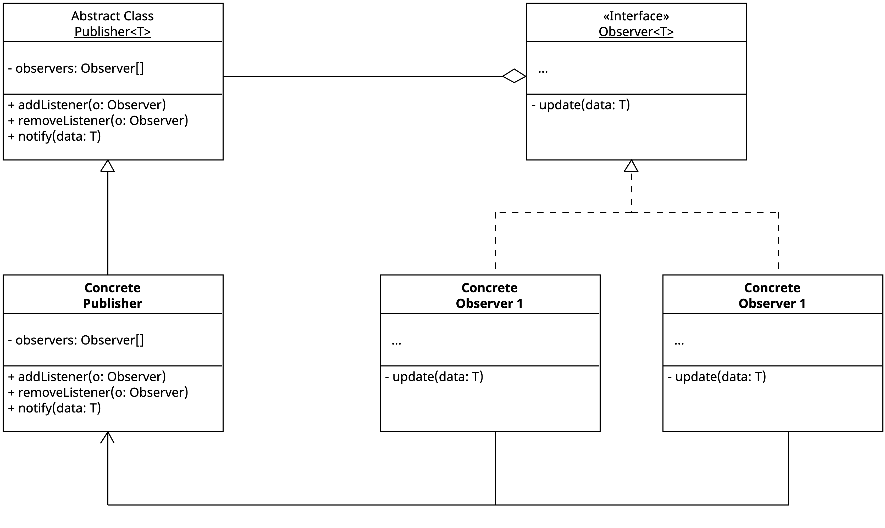

<h1 align="center">
   
  
   
  Pragma
   
</h1>

<h4 align="center">Patrón de diseño Observer en Dart</h4>

  

Este proyecto hace parte del artefacto asociado a los deseables en el uso del patrón de diseño Observer, según el caso de uso. Debemos tener en cuenta un buen análisis para la implementación de este tipo de soluciones y evitar caer en la sobreingeniería.

A continuación se comparte el diagrama de clases del proyecto, enfocado en la implementación del patrón de diseño.

  

  <a href="#topicos">Topicos</a> •
  <a href="#instalación-y-ejecución">Instalación y ejecución</a> •
  <a href="#consideraciones">Consideraciones</a> •
  <a href="#tecnologias">Tecnologías</a> •
  <a href="#credits">Autores</a> •
  <a href="#related">Relacionados</a>

## Topicos

* Dart
* Observer Pattern

## Instalación y ejecución

Para clonar y ejecutar está aplicación, necesitas [Git](https://git-scm.com) y [Dart SDK](https://dart.dev/get-dart) (normalmente instalado junto con [Flutter SDK](https://docs.flutter.dev/get-started/install)) instalados en tu equipo. Una vez clonado el repositorio, tu IDE te recomendará hacer `dart pub get`, una vez obtenidas las dependencias necesarias del proyecto mendiante el anterior comando sera posible ejecutar el example en la terminal usando el comando `dart run example/observer_pattern_example.dart`.

## Consideraciones
Para tomar una decisión informada sobre el uso del patrón de diseño Observer, es esencial evaluar ciertos aspectos clave que garantizan un diseño eficiente, mantenible y escalable. A continuación, se presentan los principales puntos a considerar:

1. **Desacoplamiento de Abstracción e Implementación**
- Si necesitas separar una abstracción de su implementación para que ambas puedan evolucionar de manera independiente.

2. **Extensibilidad y Escalabilidad**
- Si prevés que la jerarquía de clases crecerá y quieres evitar la proliferación de subclases innecesarias.

3. **Compatibilidad con Principios SOLID**
- Se alinea con el Principio de Abierto/Cerrado (OCP), permitiendo agregar nuevas implementaciones sin modificar las abstracciones existentes.

- Favorece la Inversión de Dependencias (DIP) al depender de abstracciones en lugar de implementaciones concretas.

4. **Facilidad de Mantenimiento**
- Reduce la complejidad de código al evitar estructuras de herencia rígidas y facilita modificaciones sin afectar múltiples componentes.

5. **Impacto en el Rendimiento**
- Puede introducir una ligera sobrecarga debido a la delegación, por lo que su uso debe justificarse cuando el beneficio del desacoplamiento sea mayor.

> [!TIP]  
> Utiliza el patrón **Observer** cuando necesites que varios objetos se mantengan sincronizados con el estado de otro objeto sin acoplarlos directamente.

> [!TIP]  
> Aplica el patrón cuando quieras implementar un sistema de **eventos o notificaciones** en el que los suscriptores puedan añadirse o quitarse dinámicamente.

> [!TIP]  
> Utiliza Observer cuando desees mantener una arquitectura limpia y reactiva en interfaces gráficas, donde cambios en el modelo deben reflejarse automáticamente en la vista.

## Tecnologías
-   [Dart](https://dart.dev/)

## Autores

| [ Cristian Ramirez](https://github.com/juliocruizc)   | 
:------------------------------------------------------------------------------------------------------------------------------------------------------------------------------:|

## Relacionados

- Los patrones de diseño son soluciones habituales a problemas que ocurren con frecuencia en el diseño de software. Son como planos que se pueden personalizar para resolver un problema de diseño particular de tu código. Para mayor información recomendamos visitar el siguiente [enlace](https://refactoring.guru/es/design-patterns).